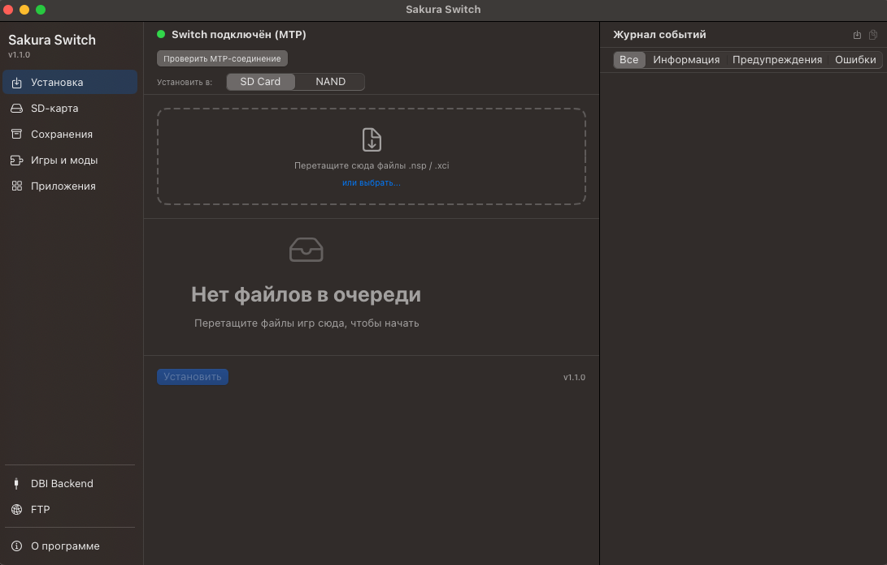
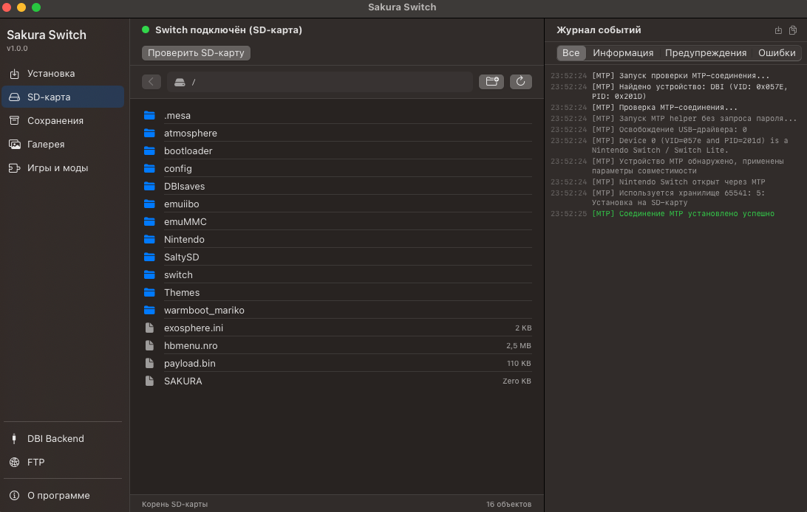
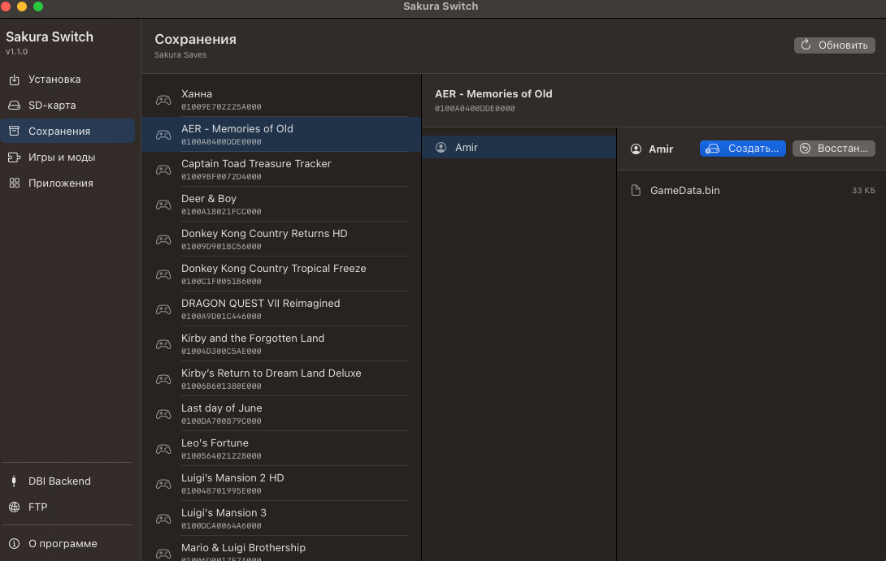
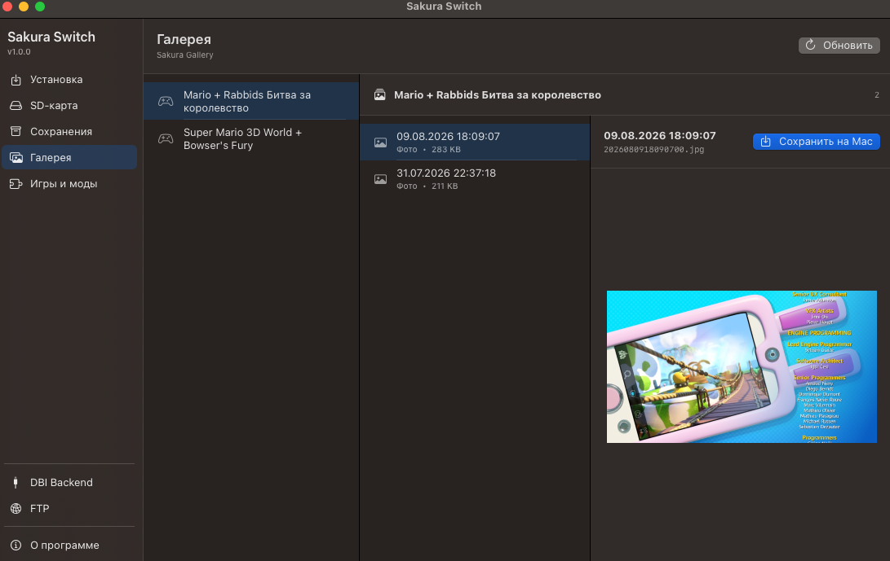
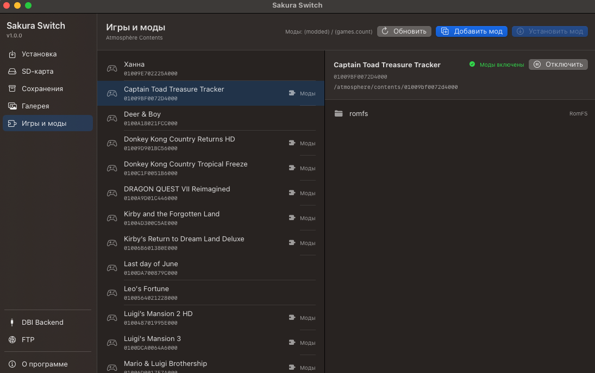
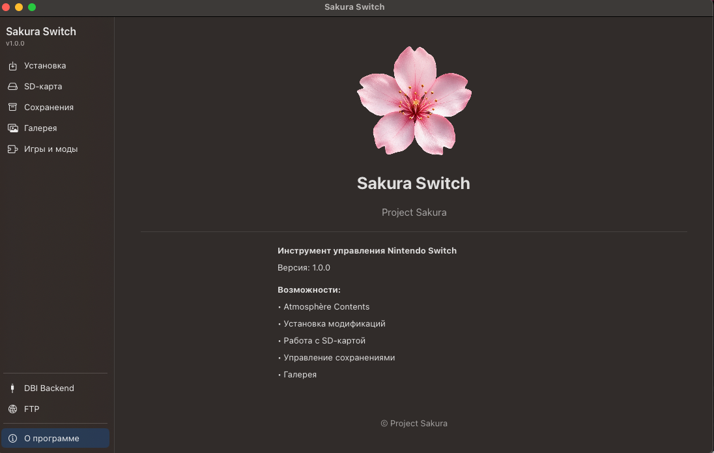

# 🌸 Sakura Switch

### Native macOS toolkit for Nintendo Switch

  
  
  
  

Установка игр, управление SD-картой, сохранениями, галереей, модами и файлами Nintendo Switch — в одном приложении.

**macOS 15.0+**

[**🌸 Скачать Sakura Switch v1.0.0**](https://github.com/borisovinfra/Sakura-Switch/releases/latest)

---

## 🌸 О программе

**Sakura Switch** — нативное приложение для macOS, созданное для удобной работы с Nintendo Switch.

Приложение объединяет работу через **MTP, DBI Backend, SD-карту и FTP** в одном интерфейсе и позволяет управлять основными данными консоли без использования нескольких отдельных программ.

---

## 🎮 Установка

Подключите Nintendo Switch через DBI и устанавливайте игры непосредственно с Mac.

- MTP через DBI
- DBI Backend
- NSP / NSZ / XCI / XCZ
- Установка на SD Card или NAND
- Drag & Drop
- Отображение скорости и прогресса
- Журнал операций в реальном времени

---

## 💾 SD-карта

Полноценная работа с содержимым SD-карты Nintendo Switch.

- Просмотр файлов и каталогов
- Навигация по структуре карты
- Работа с файлами Atmosphère
- Передача файлов между Mac и Switch

---

## 💾 Сохранения

Работа с сохранениями установленных игр.

- Поиск игр
- Просмотр данных сохранений
- Управление сохранениями Nintendo Switch

---

## 🖼 Галерея

Просмотр медиатеки Nintendo Switch непосредственно с Mac.

- Просмотр альбомов
- Скриншоты
- Видео
- Сохранение файлов на Mac

---

## 🧩 Игры и моды

Управление модификациями Atmosphère.

- Просмотр `atmosphere/contents`
- Определение установленных модификаций
- Управление состоянием модов
- Работа с игровым контентом

---

## 🌐 FTP

Работа с Nintendo Switch по локальной сети.

- FTP-подключение
- Передача файлов без USB
- Сохранение адреса консоли
- Работа через Wi-Fi

---

## ⚙️ Требования

### Mac

- macOS 15.0 или новее

### Nintendo Switch

Поддерживаются:

- DBI MTP Responder
- DBI Backend
- SD Card access
- FTP connection

---

## 📦 Установка Sakura Switch

1. Перейдите в [**Releases**](https://github.com/borisovinfra/Sakura-Switch/releases/latest).
2. Скачайте `Sakura-Switch-v1.0.0.zip`.
3. Распакуйте архив.
4. Переместите `Sakura Switch.app` в папку `Applications`.
5. Запустите приложение.

### Первый запуск

Sakura Switch пока распространяется без подписи Apple Developer.

Если macOS заблокирует первый запуск:

**Системные настройки → Конфиденциальность и безопасность → Открыть всё равно**

После первого разрешения приложение запускается обычным способом.

---

## 🔌 Подключение через MTP

1. Запустите **DBI** на Nintendo Switch.
2. Выберите **Run MTP Responder**.
3. Подключите Switch к Mac USB-кабелем.
4. Запустите Sakura Switch.
5. Проверьте статус подключения.

После успешного соединения приложение покажет:

**Switch подключён (MTP)**

---

## 🌸 Sakura Switch v1.0.0

Первый стабильный публичный релиз **Project Sakura**.

---

### 🌸 Project Sakura

Made for the Nintendo Switch community.

**Sakura Switch v1.0.0**

---

## ⚖️ Правовая информация

**Sakura Switch** — независимый проект с доступным исходным кодом, предназначенный для управления пользовательскими файлами и данными Nintendo Switch.

Sakura Switch не содержит и не распространяет игры, прошивки, ключи шифрования или иной защищённый авторским правом контент.

Пользователь самостоятельно несёт ответственность за наличие законных прав на материалы, которые он передаёт, устанавливает или использует с помощью приложения.

Nintendo Switch является товарным знаком Nintendo.  
Sakura Switch является независимым проектом и не связан с Nintendo, не поддерживается и не одобрен Nintendo.

---

## 📜 Лицензия

Исходный код **Sakura Switch** доступен для изучения, некоммерческого использования, модификации и распространения в соответствии с **PolyForm Noncommercial License 1.0.0**.

**Коммерческое использование Sakura Switch и производных работ без предварительного письменного разрешения правообладателя не разрешается.**

Copyright © 2026 Amir Borisov.  
См. `LICENSE.md` и `NOTICE`.
