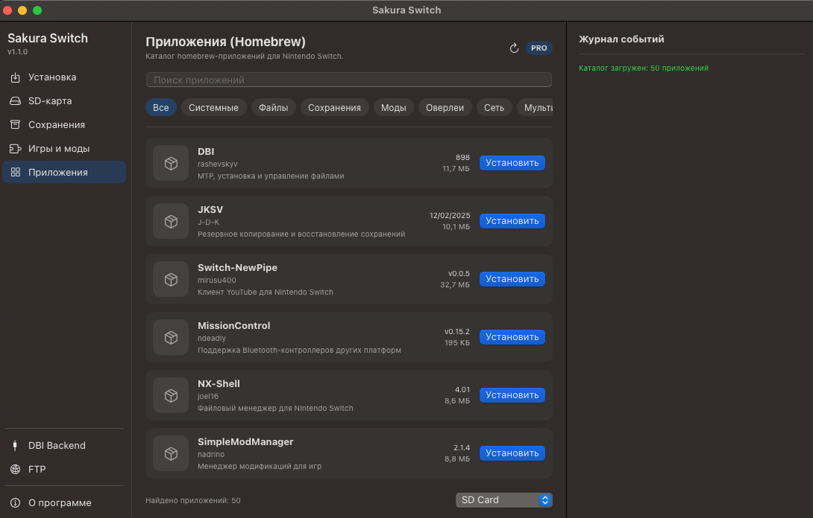
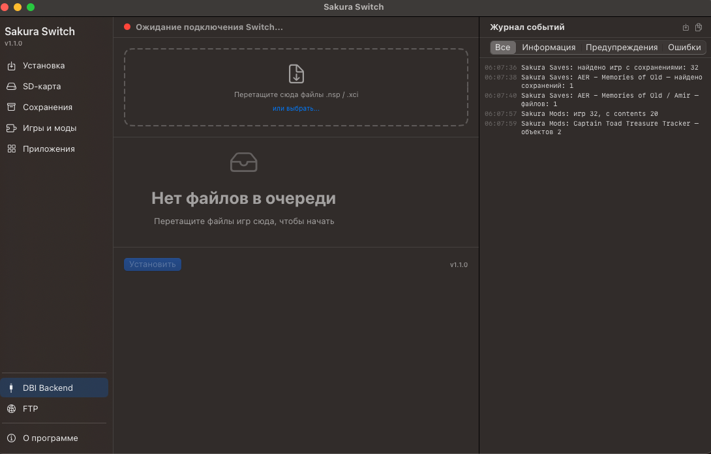
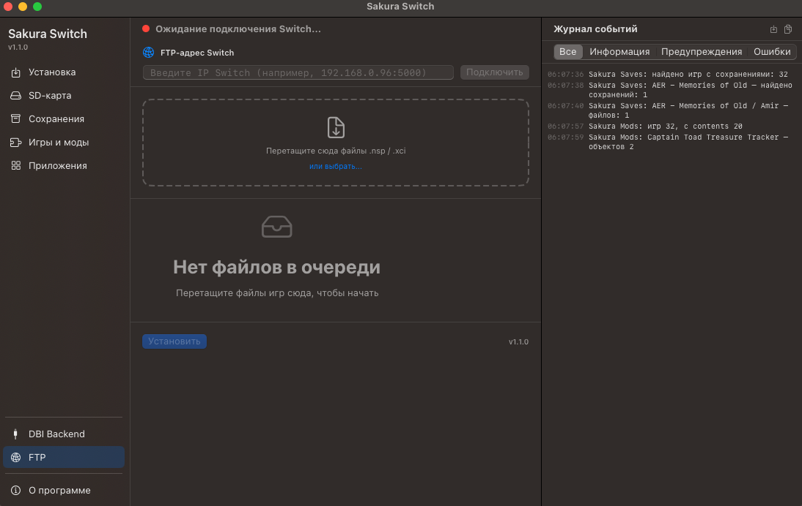
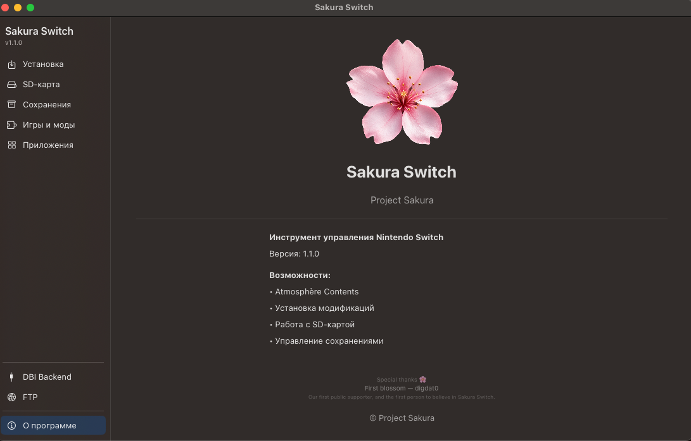

# 🌸 Sakura Switch

### Native macOS toolkit for Nintendo Switch

  
  
  
  

Установка игр и Homebrew, управление SD-картой, сохранениями, модами и файлами Nintendo Switch — в одном нативном приложении для macOS.

**macOS 15.0+**

[**🌸 Скачать Sakura Switch v1.1.0 PRO**](https://github.com/borisovinfra/Sakura-Switch/releases/latest)

**PRO — это возможности приложения, а не ценник. Sakura Switch PRO бесплатна и останется бесплатной.**

---

## 🌸 О программе

**Sakura Switch** — нативное приложение для macOS, созданное для удобной работы с Nintendo Switch.

Приложение объединяет **MTP, DBI Backend, SD-карту, Saves, Games & Mods, FTP и Homebrew-каталог** в одном интерфейсе.

Версия **v1.1.0 PRO** значительно расширяет Sakura Switch: теперь Homebrew можно находить и устанавливать непосредственно из приложения.

---

## 📦 Applications — Homebrew-каталог

Sakura Switch PRO включает встроенный каталог из **50 приложений и компонентов Nintendo Switch**.

Больше не нужно вручную искать релизы, скачивать архивы и разбираться, куда копировать их содержимое.

Вы выбираете приложение — **Sakura делает остальное.**

- 50 Homebrew-приложений и компонентов
- Поиск
- Категории
- Получение актуальных версий
- Отображение версии и размера пакета
- Безопасное обновление каталога с учётом GitHub API limits
- Установка непосредственно на подключённый Nintendo Switch

---

## ⚙️ Universal Homebrew Installer

PRO включает универсальную систему установки Homebrew.

Поддерживаемые форматы:

**NRO · OVL · ZIP · 7z · BIN**

Sakura автоматически определяет тип пакета и необходимую структуру установки.

Поддерживаются:

- обычные Homebrew-приложения;
- Tesla overlays;
- системные компоненты;
- многокомпонентные архивы;
- payload-файлы;
- пакеты со структурой SD-карты.

Для приложений со специальными путями установки Sakura использует соответствующие расположения автоматически.

---

## 🛡️ Безопасная установка

Установщик Homebrew построен как транзакционная система.

Перед заменой существующих файлов Sakura создаёт резервную копию, устанавливает новую версию, проверяет результат и только после успешной проверки завершает операцию.

**Backup → Install → Verify → Commit / Rollback**

При ошибке Sakura пытается восстановить предыдущее состояние.

Пользовательские конфигурационные файлы сохраняются при обновлении.

В частности, существующий:

`/switch/DBI/dbi.config`

**не заменяется.**

---

## 🎮 Установка игр

Подключите Nintendo Switch через DBI и устанавливайте поддерживаемый контент непосредственно с Mac.

- MTP через DBI
- DBI Backend
- NSP / NSZ / XCI / XCZ
- Установка на SD Card или NAND
- Drag & Drop
- Отображение скорости и прогресса
- Журнал операций в реальном времени

---

## 💾 SD-карта

Полноценная работа с содержимым SD-карты Nintendo Switch.

- Просмотр файлов и каталогов
- Навигация по структуре карты
- Работа с файлами Atmosphère
- Передача файлов между Mac и Switch

---

## 💾 Сохранения

Работа с сохранениями установленных игр.

- Поиск игр
- Просмотр данных сохранений
- Управление сохранениями Nintendo Switch

---

## 🧩 Игры и моды

Управление модификациями Atmosphère.

- Просмотр `atmosphere/contents`
- Определение установленных модификаций
- Управление состоянием модов
- Работа с игровым контентом

---

## 🔌 DBI Backend

Работа с DBI Backend непосредственно из Sakura Switch.

- Запуск и остановка DBI Backend
- Контроль состояния подключения
- Просмотр адреса и порта
- Журнал событий в реальном времени

---

## 🌐 FTP

Работа с Nintendo Switch по локальной сети.

- FTP-подключение
- Передача файлов без USB
- Сохранение адреса консоли
- Работа через Wi-Fi

---

## 🌍 Три языка

Sakura Switch v1.1.0 поддерживает:

**🇷🇺 Русский**  
**🇬🇧 English**  
**🇯🇵 日本語**

Язык выбирается автоматически в соответствии с настройками macOS.

Локализованы интерфейс, статусы, ошибки, диалоги, подсказки и возможности PRO.

---

## 🍎 Нативное приложение для macOS

Sakura Switch является самостоятельным приложением и включает необходимые компоненты для работы MTP.

Пользователю не требуется вручную устанавливать:

**Homebrew · libmtp · libusb · MTP helper**

Необходимые библиотеки и MTP helper находятся внутри приложения.

При первом использовании привилегированных MTP-операций macOS показывает стандартное окно авторизации администратора, после чего необходимое окружение подготавливается автоматически.

---

## ⚙️ Требования

### Mac

- macOS 15.0 или новее

### Nintendo Switch

В зависимости от используемой функции поддерживаются:

- DBI MTP Responder
- DBI Backend
- SD Card access
- FTP connection

---

## 📦 Установка Sakura Switch

1. Перейдите в [**Releases**](https://github.com/borisovinfra/Sakura-Switch/releases/latest).
2. Скачайте `Sakura-Switch-v1.1.0-PRO.zip`.
3. Распакуйте архив.
4. Переместите `Sakura Switch.app` в папку `Applications`.
5. Запустите приложение.

### Первый запуск

Sakura Switch пока распространяется без подписи Apple Developer.

Если macOS заблокирует первый запуск:

**Системные настройки → Конфиденциальность и безопасность → Открыть всё равно**

После первого разрешения приложение запускается обычным способом.

### Первый запуск MTP

При первом использовании MTP Sakura Switch автоматически устанавливает вспомогательный MTP-компонент и необходимые библиотеки.

macOS один раз покажет стандартное окно авторизации администратора.

После подтверждения дальнейшие MTP-операции выполняются без повторного ввода пароля.

**Homebrew, libmtp, libusb и ручная установка MTP helper не требуются.**

---

## 🔌 Подключение через MTP

1. Запустите **DBI** на Nintendo Switch.
2. Выберите **Run MTP Responder**.
3. Подключите Switch к Mac USB-кабелем.
4. Запустите Sakura Switch.
5. Проверьте статус подключения.

После успешного соединения приложение покажет:

**Switch подключён (MTP)**

---

## ❤️ Sakura Switch PRO бесплатна

Название **PRO** не означает платную версию.

Sakura Switch PRO распространяется бесплатно.

Мы не планируем вводить:

- подписку;
- платную разблокировку PRO;
- платный доступ к каталогу приложений;
- оплату за использование Sakura Switch.

**PRO — это возможности приложения, а не ценник.**

---

## 🌸 Sakura Switch v1.1.0 PRO

Актуальный стабильный релиз **Project Sakura**.

Подробности обновления доступны на странице [**Sakura Switch v1.1.0 PRO**](https://github.com/borisovinfra/Sakura-Switch/releases/tag/v1.1.0).

---

### 🌸 Project Sakura

Made for the Nintendo Switch community.

**Sakura Switch v1.1.0 PRO**

**Sakura цветёт. 🌸**

---

## ⚖️ Правовая информация

**Sakura Switch** — независимый проект с доступным исходным кодом, предназначенный для управления пользовательскими файлами и данными Nintendo Switch.

Sakura Switch не содержит и не распространяет игры, прошивки, ключи шифрования или иной защищённый авторским правом контент.

Пользователь самостоятельно несёт ответственность за наличие законных прав на материалы, которые он передаёт, устанавливает или использует с помощью приложения.

Nintendo Switch является товарным знаком Nintendo.

Sakura Switch является независимым проектом и не связан с Nintendo, не поддерживается и не одобрен Nintendo.

---

## 📜 Лицензия

Исходный код **Sakura Switch** доступен для изучения, некоммерческого использования, модификации и распространения в соответствии с **PolyForm Noncommercial License 1.0.0**.

**Коммерческое использование Sakura Switch и производных работ без предварительного письменного разрешения правообладателя не разрешается.**

Copyright © 2026 Amir Borisov.

Sakura Switch включает сторонние библиотеки, распространяемые на условиях их собственных лицензий. Подробности см. в `THIRD_PARTY_NOTICES.md` и `ThirdPartyLicenses/`.

См. `LICENSE.md` и `NOTICE`.
